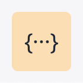
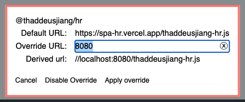

# @thaddeusjiang/hr

> A [single-spa](https://single-spa.js.org/) application for HRMS.

## Getting Started

1. start [root-config](https://github.com/ThaddeusJiang/spa-root-config) in local.
2. start this application

```
yarn install

yarn start
```

access http://localhost:9000 and open devtool console, run `localStorage.devtools = true` then you can see devtool in right-bottom of window.



click it and override modules



I will deploy a root-config for develop later, then you can develop single-spa in http://spa-hr.thaddeusjiang.com.

### Mock REST API in local

```
yarn start:mock-rest
```

## Docs

We are using micro-frontends, don't write common docs in isolate repository.

[common docs]()

## TODO:

- [ ] react 18
- [ ] react-router v6
- [ ] setup [mswjs](https://mswjs.io/)
- [ ] write utility-first CSS same as [tailwindcss-typography](https://github.com/tailwindlabs/tailwindcss-typography)
